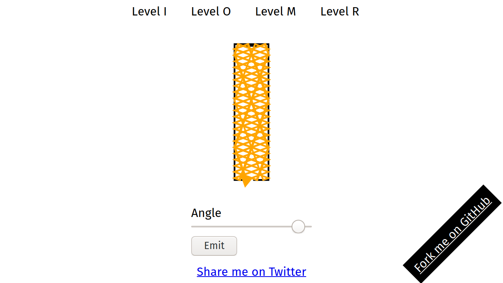

# I Really Move On

Archived. The code moved to [my own domain](https://jaenis.ch/hobbies/coding/repos/ryuno-ki/gamedevjs-2021).

This repositories hosts [my entry][entry] for [GamedevJS 2021 jam][gamedevjs].
The topic is Mirror. If you deduplicate it, you can form the anagram IRMO.

When I think on mirrors, I think on reflection of light. So this what this
entry is about: you have a light source, that emits light. Your goal is to
find the right angle to make it cross the target.

## License

GPL v3 or newer. See LICENSE.

[entry]: https://ryuno-ki.itch.io/i-really-move-on
[gamedevjs]: https://itch.io/jam/gamedevjs-2021
